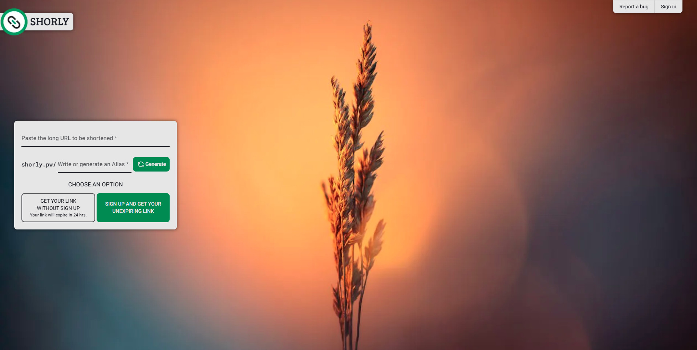

<div align="center">

<a href="https://shorly.pw">

</a>

<p></p>


[](https://nodejs.org/about/releases)

## 🔗 WELCOME TO SHORLY.PW - The URL Shortener Project 🔗

</div>

Shorly was born as an alternative to many other URL shorteners, offering the option to **create 50 free links per day without the need to register**.

As a developer, I have created this project to practice and improve my knowledge in the following technologies:

- ➡️ **Next.js 14 Framework and new added Server Actions** ([Website](https://nextjs.org/)).
- ➡️ **TypeScript** ([Website](https://www.typescriptlang.org/)).
- ➡️ **Supabase Database and Auth** ([Website](https://supabase.com/)).
- ➡️ **TailwindCSS** ([Website](https://tailwindcss.com)) **and Flowbite components** ([Website](https://flowbite.com/docs/components/)).
- Use of other packages like:
  - ➡️ **Tailwindcss Animated** ([Website](https://www.tailwindcss-animated.com/)).
  - ➡️ **React Toastify** ([Website](https://fkhadra.github.io/react-toastify)).
  - ➡️ **Unsplash Image API** ([Website](https://unsplash.com/developers)).

## 🚀 Getting Started

> 🚨 You will need [Nodejs +18.17 (LTS recommended)](https://nodejs.org/en/) installed.

1. Fork this project:

- [Click here](https://github.com/novopowa/shorly/fork).

2. Clone the repository:

```bash
git clone git@github.com:YOU_USER/shorly.git
```

3. Install dependencies:

```bash
npm install
# or
yarn install
# or
pnpm install
# or
bun install
```

4. Create a **.env** file with the following content:

```bash
# Supabase DB URL's:
NEXT_PUBLIC_SUPABASE_URL=
NEXT_PUBLIC_SUPABASE_ANON_KEY=

# Unsplash API Acces Key
UNSPLASH_ACCESS_KEY=

# Vercel Cron Key
CRON_SECRET=

# Google Recaptcha Keys:
NEXT_PUBLIC_RECAPTCHA_SITE_KEY=
RECAPTCHA_SECRET_KEY=
```

You will also need to place your **Supabase project ID** in the **'supabase-entities'** script of your package.json file.

```bash
 # /package.json
 ...
  "scripts": {
   ...
   "supabase-entities": "npx supabase gen types typescript --project-id [id] > ./app/types/database.ts"
```

And also change the images in the `public` folder and the project name **SHORLY** within the code (this is pending improvement with a global variable)

5. All Ready! Now run:

```
npm run supabase-entities

# Run the project:
npm run dev
```
